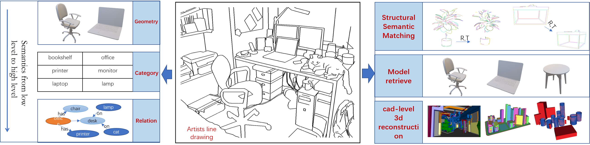
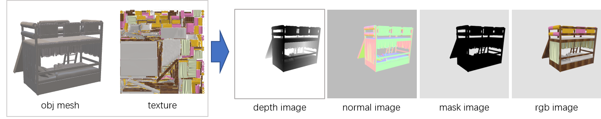

# Geometric Structure Semantic Understanding Dataset Toolbox


## Motivation



​	Humans have been painting since the days of prehistoric cave painting. Since then, various forms of line drawing have developed, including Egyptian hieroglyphics, medieval etchings, and industrial age prints. Through introspection and experimentation, human artists have learned to express scene information with concise lines to provide striking depictions of shapes and meanings, conveying to people the geometry, function, relationship, etc. of objects in the scene. In addition, neuroscientific studies of the human visual perception system have shown that the human visual system is modular, and through studies of patients with impaired advanced cognitive function, it has been found that shape contours play an important role in the "spatial pathways" of these brains. Partially damaged patients are able to move and manipulate objects normally even if they do not know the meaning of the objects they are manipulating. Building a shape and contour perception module in the robot visual perception system to obtain the concise expression ability of the scene similar to that of an artist, which is very important for robot autonomy and development.
​	Different from Edge-like visual representation, appearing in form of image edges, object boundaries and contours, is of great research interest in both computer vision and computer graphics. On the one hand, Edge-like visual representation is a low-level visual behavior, which mainly The low-level mutation of features such as brightness and color is defined, and edge detection is completed by identifying the points with obvious brightness changes in the image, while the structural semantic lines mainly express the contours of objects with obvious changes in geometry. On the other hand, the structural outline is a re-creation of human beings combining their own cognition and the global semantics of the context. The purpose is to a large extent to realize the transmission of information and allow the audience to reproduce the same perception. Edge-like visual representation lacks this An active selection process based on the cognitive background of existing knowledge.
​	In order to endow robots with visual perception capabilities similar to human "spatial pathways", we constructed Geometric Structure Semantic Understanding Dataset based on non-realistic rendering technology, which can be used for "structural semantic extraction", "pose estimation", "CAD" Retrieval”, “3D Modeling”, “Robot Active Perception” and other researches.

## Dataset Abstract

**待完成**

**网盘链接**

## Usage

### 1. Render 



In the rendering part, rgb images and depth maps are generated according to the Mesh model and texture files. The original 3D future dataset provides a rendering script based on blender. The internal and external parameters of the camera are converted and output in the cv coordinate system, so that all operations on the same set of data are based on the same camera parameters.

- Install and set up blender and python environment, refer to [3D-FUTURE-ToolBox](https://github.com/3D-FRONT-FUTURE/3D-FUTURE-ToolBox)

- After installation, use the following command

  ```
  bash ./src/render_image/render_model.sh
  ```

  will render the example model in the ./demodata/3d_future folder, and save the result in the ./demodata/Rendered folder.

### 2. Transfrom and Clean Mesh

Rotate and translate the mesh model according to the external parameters of the camera, and use the meshlab script to preprocess the mesh, so that the topological model of the model satisfies the manifold mathematically, and prepares for the contour generation of the non-photorealistic rendering algorithm.

- Under the ./src/transfrom_model_with_extrinsic folder, we provide C++ code to rotate and translate the 3D model according to the camera extrinsic parameters, and a python script to implement batch processing. The camera parameters used for rendering are saved in the ./configs/camera_intrinsic_extrinsic folder.

  ```
  ./src/transfrom_model_with_extrinsic/build/TransformOBJ normalized_model.obj ./configs/camera_intrinsic_extrinsic/model_000.txt normalized_model_transformed.obj
  ```

  ```
  python TransformModel.py
  ```

- Under the ./src/clean_obj folder,  Based on meshlab, we provide a python script to make the model topologically satisfy the manifold.

  ```
  # in ./src/clean_obj run
  python objClear.py
  ```

### 3. Generate Contour SVG


**Non-photorealistic rendering** (**NPR**) is an area of [computer graphics](https://en.wikipedia.org/wiki/Computer_graphics) that focuses on enabling a wide variety of expressive [styles](https://en.wikipedia.org/wiki/Style_(visual_arts)) for digital art, in contrast to traditional [computer graphics](https://en.wikipedia.org/wiki/Computer_graphics), which focuses on [photorealism](https://en.wikipedia.org/wiki/Photorealism). NPR is inspired by other artistic modes such as [painting](https://en.wikipedia.org/wiki/Painting), [drawing](https://en.wikipedia.org/wiki/Drawing), [technical illustration](https://en.wikipedia.org/wiki/Technical_illustration), and [animated cartoons](https://en.wikipedia.org/wiki/Animated_cartoons). NPR has appeared in [movies](https://en.wikipedia.org/wiki/Film) and [video games](https://en.wikipedia.org/wiki/Video_game) in the form of [cel-shaded animation](https://en.wikipedia.org/wiki/Cel_shading) (also known as "[toon](https://en.wikipedia.org/wiki/Cartoon)" shading) as well as in [scientific visualization](https://en.wikipedia.org/wiki/Scientific_visualization), [architectural illustration](https://en.wikipedia.org/wiki/Architectural_illustration) and [experimental animation](https://en.wikipedia.org/wiki/Experimental_animation). We have modified two open source non-photorealistic rendering methods  ( [trianglemesh](https://github.com/zddhub/trianglemesh)
[Syndraw](https://gitlab.inria.fr/D3/contour-detect) ) to suit our needs. 

- First, According to the [trianglemesh](https://github.com/zddhub/trianglemesh) and [Syndraw](https://gitlab.inria.fr/D3/contour-detect) webpage introduction to install the corresponding dependencies, our modified code Versions are stored under ./src/calculate_pv_pd and ./src/calculate_contour respectively.

1. Use the script we provided, The generated SVG initial annotations are saved in the ./demodata/structure_contours/ folder.

   ```
   export LD_LIBRARY_PATH=$LD_LIBRARY_PATH:/opt/Qt5.14.2/5.14.2/gcc_64/lib
   export QTDIR=/opt/Qt5.14.2/5.14.2/gcc_64
   export PATH=$PATH:/opt/Qt5.14.2/5.14.2/gcc_64/bin
   # in ./src/calculate_contour run:
   python generateContour.py
   ```

2. step by step procedure

- Second, calculate pv pd with  X server. in ./src/calculate_pv_pd/build, try run

  ```
  export LD_LIBRARY_PATH=$LD_LIBRARY_PATH:/opt/Qt5.14.2/5.14.2/gcc_64/lib
  export QTDIR=/opt/Qt5.14.2/5.14.2/gcc_64
  export PATH=$PATH:/opt/Qt5.14.2/5.14.2/gcc_64/bin
  
  ./gen_view_image " + InputMeshPath + " " + OutJPGpath
  ./gen_view_image test_000.obj  test_000.jpg
  ```

  or, calculate pv pd without X server, in my case, use in docker.

  ```
  export LD_LIBRARY_PATH=$LD_LIBRARY_PATH:/opt/Qt5.14.2/5.14.2/gcc_64/lib
  export QTDIR=/opt/Qt5.14.2/5.14.2/gcc_64
  export PATH=$PATH:/opt/Qt5.14.2/5.14.2/gcc_64/bin
  
  xvfb-run ./gen_view_image test_000.obj test_000.jpg
  ```

  The successful execution of the above code will generate pd1.txt, pd2.txt, pv1.txt, pv2.txt in the folder, and the generated files will be used as the input for the next execution. Make sure to copy them to ./src/ during single-step testing. calculate_contour/SynDraw/build folder.

- Third,   Refer to the following command to generate the corresponding Contour according to the mesh; the model here should use the model after Transfrom and cleaned to ensure the consistency with Blender rendering; Camera internal parameters and Contour parameter configuration reference: ./configs/ .  Try following code  in ./src/calculate_contour/SynDraw/build 

  ```
  ./SynDraw -p ../../../configs/npr_contour_parameter/contour.properties xxx.obj xxx.svg
  ./SynDraw -p ../../../configs/npr_contour_parameter/contour.properties test_000.obj 11.svg
  ```

### 4. Refine

- Refine the generated annotations according to the depth edge, normal vector map, and line segment overlap, connectivity, etc.

  ```
  # In ./src/postprocess run
  python refine3.py
  ```


### References and Acknowledgments
[LINE DRAWINGS FROM 3D MODELS:A TUTORIAL](https://arxiv.org/abs/1810.01175)
[trianglemesh](https://github.com/zddhub/trianglemesh)
[Syndraw](https://gitlab.inria.fr/D3/contour-detect)
[3D-FUTURE-ToolBox](https://github.com/3D-FRONT-FUTURE/3D-FUTURE-ToolBox)
[VectorGraphRenderer](https://github.com/hjwdzh/VectorGraphRenderer)

